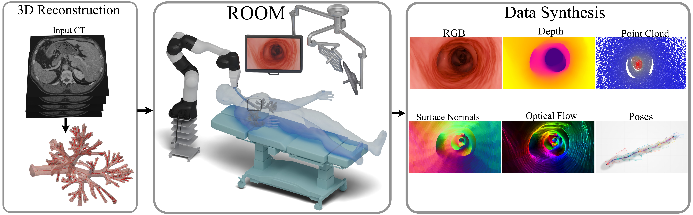
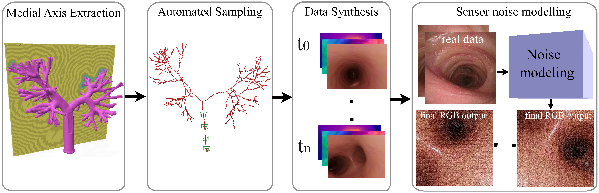

# ROOM: A Physics-Based Continuum Robot Simulator for Photorealistic Medical Datasets Generation

[](https://arxiv.org)
[](http://iamsalvatore.io/room/)
[](https://opensource.org/licenses/MIT)

### 🌐 **[Visit our Project Website](http://iamsalvatore.io/room/)** for interactive demos, videos, and detailed information.

[**Paper**](http://iamsalvatore.io/room/assets/room.pdf) | [**arXiv**](https://arxiv.org) | [**Project Page**](http://iamsalvatore.io/room/) | [**Dataset**](#) | [**Video**](#)

## Overview

ROOM (Realistic Optical Observation in Medicine) is a comprehensive simulation framework designed for generating photorealistic bronchoscopy training data. By leveraging patient CT scans, our pipeline renders multi-modal sensor data including RGB images with realistic noise and light specularities, metric depth maps, surface normals, optical flow, and point clouds at medically relevant scales.

<p align="center">
  
</p>

## Key Features

- 🤖 **Physics-Based Simulation**: Accurate continuum robot dynamics with realistic tissue interactions using PyBullet
- 📸 **Photorealistic Rendering**: Path-traced imagery with endoscopic lighting and sensor noise modeling via Blender
- 🎯 **Multi-Modal Data**: Synchronized RGB, depth, surface normals, optical flow, and point cloud generation
- 🫁 **Patient-Specific Models**: Automated pipeline from CT scans to anatomically accurate 3D lung models
- 🔄 **Automated Data Collection**: Medial axis extraction and intelligent sampling for comprehensive coverage

## Paper

**ROOM: A Physics-Based Continuum Robot Simulator for Photorealistic Medical Datasets Generation**
Salvatore Esposito, Matías Mattamala, Daniel Rebain, Francis Xiatian Zhang, Kevin Dhaliwal, Mohsen Khadem, Subramanian Ramamoorthy
*University of Edinburgh, University of British Columbia*
arXiv Preprint 2025

### Abstract

Continuum robots are advancing bronchoscopy procedures by accessing complex lung airways and enabling targeted interventions. However, their development is limited by the lack of realistic training and test environments: Real data is difficult to collect due to ethical constraints and patient safety concerns, and developing autonomy algorithms requires realistic imaging and physical feedback. We present ROOM, a comprehensive simulation framework designed for generating photorealistic bronchoscopy training data. By leveraging patient CT scans, our pipeline renders multi-modal sensor data at medically relevant scales. We validate the data generated by ROOM through monocular depth estimation experiments, demonstrating diverse challenges that state-of-the-art methods must overcome to transfer to these medical settings. Furthermore, we show that the data produced by ROOM can be used to fine-tune existing depth estimation models, enabling applications such as vision-based navigation.

## Installation

### Prerequisites

- Python 3.8+
- CUDA 11.3+ (for GPU acceleration)
- Blender 4.5+ (for photorealistic rendering)
- PyBullet (for physics simulation)

### Setup

```bash
# Clone the repository
git clone https://github.com/iamsalvatore/room.git
cd room

# Create virtual environment
python -m venv room_env
source room_env/bin/activate  # On Windows: room_env\Scripts\activate

# Install dependencies (coming soon)
pip install -r requirements.txt
```

## Quick Start

```python
# Coming soon
import room

# Initialize simulator with patient CT scan
simulator = room.Simulator(ct_path="path/to/ct_scan.nii.gz")

# Generate trajectory through airways
trajectory = simulator.generate_trajectory()

# Render multi-modal data
data = simulator.render_sequence(
    trajectory,
    modalities=['rgb', 'depth', 'normals', 'optical_flow']
)
```

## Dataset

The ROOM dataset includes:

- **Multi-Modal Sensor Data**: RGB images (600×600), metric depth maps, surface normals, optical flow, point clouds
- **Ground Truth Annotations**: 6-DOF camera poses, segmentation masks, medial axis paths
- **Diverse Scenarios**: Multiple patient anatomies, various navigation trajectories, realistic sensor noise

Download links coming soon.

## Pipeline Overview

<p align="center">
  
</p>

Our pipeline consists of four main stages:

1. **Medial Axis Extraction**: Extract navigation paths from segmented CT lung models
2. **Automated Sampling**: Intelligent sampling with higher density at bifurcations
3. **Data Synthesis**: Generate synchronized multi-modal sensor streams
4. **Sensor Noise Modeling**: Apply realistic noise matching real bronchoscopy imagery

## Results

### Monocular Depth Estimation - Fine-tuning with ROOM Data

<p align="center">
  
</p>

Models fine-tuned on ROOM synthetic data demonstrate significant improvements on real bronchoscopy images, validating our simulation framework's effectiveness for domain adaptation.

### Vision-Based Navigation

<p align="center">
  
</p>

Our framework enables MPC-based navigation through airways using depth predictions from models trained on ROOM data.

## Applications

ROOM enables various applications in medical robotics:

- **Navigation Policy Training**: RL-based autonomous navigation in airways
- **Depth Estimation**: Domain adaptation for monocular depth networks
- **3D Reconstruction**: Structure-from-motion in challenging medical environments
- **Pose Estimation**: Visual odometry for bronchoscope localization

## Code Structure

```
room/
├── assets/           # Website assets
│   ├── images/       # Paper figures
│   └── videos/       # Demo videos
├── room/             # Core library (coming soon)
│   ├── simulator/    # Physics simulation
│   ├── rendering/    # Photorealistic rendering
│   ├── processing/   # CT scan processing
│   └── utils/        # Utility functions
├── examples/         # Example scripts (coming soon)
├── configs/          # Configuration files (coming soon)
└── README.md         # This file
```

## Citation

If you find our work useful in your research, please consider citing:

```bibtex
@article{esposito2025room,
  title={ROOM: A Physics-Based Continuum Robot Simulator for
         Photorealistic Medical Datasets Generation},
  author={Esposito, Salvatore and Mattamala, Mat{\'\i}as and
          Rebain, Daniel and Zhang, Francis Xiatian and
          Dhaliwal, Kevin and Khadem, Mohsen and
          Ramamoorthy, Subramanian},
  journal={arXiv preprint arXiv:2025.xxxxx},
  year={2025}
}
```

## License

This project is licensed under the MIT License - see the [LICENSE](LICENSE) file for details.

## Acknowledgments

This work was supported by a UKRI Turing AI World Leading Researcher Fellowship on AI for Person-Centred and Teachable Autonomy (grant EP/Z534833/1).

## Contact

For questions and feedback, please contact:
- Salvatore Esposito: [sesposit@ed.ac.uk](mailto:sesposit@ed.ac.uk)
- Project Issues: [GitHub Issues](https://github.com/iamsalvatore/room/issues)

---

<p align="center">
  <a href="http://iamsalvatore.io/room/">Visit our project website for more information and interactive demos</a>
</p>